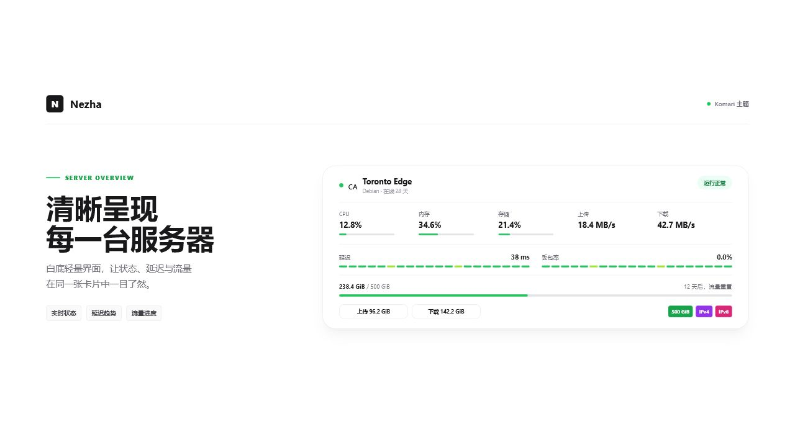

# Nezha

[](https://github.com/nuomiiiii/nezha/releases)
[](https://github.com/komari-monitor/theme-market)
[](LICENSE)

基于 [BITJEBE/nezha-BITJEBE](https://github.com/BITJEBE/nezha-BITJEBE) 二次开发的 [Komari Monitor](https://github.com/komari-monitor/komari) 自定义主题。当前版本为 `3.0.7`，已进入 Komari 官方主题商城。



## 最近更新

### 3.0.7

- 修复首页未使用 Komari 后台自定义站点图标的问题，首页与后台浏览器标签页现在保持一致。
- 站点 Logo 继续只用于主题页头展示，不再覆盖浏览器标签页图标。

### 3.0.6

- 优化主题样式与生产资源构建，减少文件体积和首次加载请求。
- 清理未使用代码与冗余依赖，修复部分环境首页白屏、重连未立即刷新、主题设置重复请求和自定义 CSS 链接注入问题。
- 补齐移动端 Web App 声明并消除 Edge 图片加载提示，保留 Komari `1.1.8` 至 `2.1.x` 的延迟接口兼容。

### 3.0.5

- 首页有探测记录但完全丢包时显示红色；完全没有探测记录时继续显示灰色，避免混淆故障与无数据。
- 详情页完全丢包且没有有效 RTT 时保留断线，不再把丢包点与前后正常延迟错误连接。
- 部分丢包时保留成功探测的真实 RTT，延迟曲线继续按有效数据展示。
- 保持 Komari `1.1.8`、`1.2.5-fix2`、`1.2.7`、`1.3.0` 与本分支 `2.1.x` 的新旧延迟接口兼容。

### 3.0.4

- 修复刷新首页时延迟与丢包率晚于其他卡片内容出现的问题；刷新时先显示当前会话最近一次成功结果，并在后台更新。
- 旧版 Komari 会记住已确认的延迟接口能力，刷新时不再重复等待一次不支持的 V4 请求。
- 会话缓存仅用于刷新过渡，不写入服务端、不改变历史数据或统计精度。
- 兼容 Komari `1.1.8`、`1.2.5-fix2`、`1.2.7`、`1.3.0` 与本分支 `2.1.x`。

### 3.0.3

- 修复 Komari `1.1.8`、`1.2.5-fix2` 等旧版本稀疏探测记录下，丢包率文字与趋势色块口径不一致的问题。
- 首页统一展示最近一小时的 12 个五分钟时间桶；缺失数据使用灰色占位，丢包率按同一窗口内的真实探测次数加权。
- 保持 Komari `1.2.7`、`1.3.0` 与本分支 `2.1.x` 的 V4 指标接口兼容。
- 默认黑底 N 图标替换为新版 Komari Logo；自定义 Logo 预加载成功后再切换，避免加载时来回闪烁。

### 3.0.2

- 修复 Komari `1.1.8`、`1.2.5-fix2` 等旧版本中首页延迟持续显示“加载中”的问题。
- 新版优先读取 `public:queryMetrics` V4 指标接口；接口不存在或旧版公共 RPC 被拒绝时，自动回退到 `/api/records/ping`。
- 请求真正失败时退出加载状态，显示明确错误和重试入口，不再无限等待。
- 保持 Komari `1.2.7`、`1.3.0` 与本分支 `2.1.x` 的新版指标接口行为不变。

### 3.0.0

- 新增默认概览卡片，在同一卡片内整合运行状态、资源、实时速率、账单、标签、流量和延迟信息。
- 首页新增最近一小时延迟、丢包率和趋势展示，并提供独立开关。
- 保留固定左侧名称、固定顶部名称两种原有布局；剩余天数时间条、概览手掌、动画插图和上下行流量均可单独控制。
- 网络详情页默认进入 `1H` 视图，减少首次查看时的等待。

完整记录见 [CHANGELOG.md](CHANGELOG.md)。

## 功能特性

### 首页概览与延迟监测

- 默认概览卡片集中展示运行状态、CPU、内存、磁盘、实时速率、上下行总量、账单、标签和到期时间
- 首页延迟监测默认开启，显示最近一小时的延迟、丢包率与趋势
- 多个延迟任务按照 Komari 后台的任务顺序展示
- 无数据时显示稳定空状态；接口失败时提供错误信息和重试入口
- 到期不足 14 天时，剩余时间使用红色提醒
- 支持默认、固定左侧服务器名称和固定顶部服务器名称三种卡片布局

### 旧版与新版 Komari 兼容

| Komari 环境 | 延迟数据方式 |
| --- | --- |
| `1.1.8`、`1.2.5-fix2` 等未提供新版指标接口的版本 | 自动回退到访客可用的 `/api/records/ping` |
| 提供 `public:queryMetrics` 的版本，包括 `1.2.7`、`1.3.0` 和 `2.1.x` | 使用支持 raw/rollup 的 V4 指标查询 |

回退只在“方法不存在”或旧版公共 RPC 拒绝场景触发。真实的存储、网络或权限错误仍会明确显示，不会被误判成旧版兼容问题。

### 流量与账单

- 卡片内置流量使用进度条，无需注入外部脚本
- 支持 `sum`、`max`、`min`、`up`、`down` 五种流量计算模式
- 支持百分比、距离下次重置的天数和计费模式轮播
- 支持显示或隐藏上下行总流量、流量标签、IPv4/IPv6 标签和剩余天数时间条
- 支持 CNY、JPY、USD、EUR、HKD、TWD、KRW、SGD、CAD、AUD 等币种，并允许按服务器覆盖
- 资产卡片可汇总服务器账单、剩余价值和币种换算

### 标签与外观

- 标签使用 `;` 分隔，例如 `So-net<red>;CDN<blue>`
- 支持 Radix UI 色名；未指定颜色时根据标签文本稳定分配颜色
- 支持自定义桌面/移动背景、Logo、插图、导航链接和分组顺序
- 支持亮色、暗色和跟随系统模式
- SVG 国旗、概览手掌、动画插图均可在主题管理中控制

### 服务监控

- 支持 30 天服务可用性视图，按日展示在线、离线和延迟
- 新版使用 raw/rollup 指标；旧版自动使用公开延迟记录接口
- 平均延迟自动排除无数据和丢包记录

## 安装

### Komari 官方主题商城

进入 Komari 后台的“市场/主题市场”，找到 `Nezha` 后直接安装。商城版本由官方自动同步最新 GitHub Release，更新可能需要等待商城维护者合并自动更新。

### 上传主题包

1. 从 [Releases](https://github.com/nuomiiiii/nezha/releases) 下载最新的 `nezha-v*.zip`。
2. 进入 Komari 后台的“主题管理”。
3. 上传 ZIP；已安装旧版时可直接覆盖更新。

不要下载 GitHub 自动生成的 Source code ZIP，它不是可安装主题包。

### 从源码构建

```bash
git clone https://github.com/nuomiiiii/nezha.git
cd nezha
npm install
npm run build
```

构建产物位于 `dist/`。手工打包时，`komari-theme.json`、manifest 指定的预览图和 `dist/` 必须位于 ZIP 根目录。

## 主题设置

### 延迟监测

“显示首页延迟监测”默认开启。关闭后不仅隐藏卡片内容，也会停止首页对应的数据查询。使用前需要在 Komari 后台创建延迟监测任务并分配服务器。

### 流量限制

在 Komari 后台按服务器设置：

- `traffic_limit`：流量上限，单位为字节
- `traffic_limit_type`：`sum`、`max`、`min`、`up` 或 `down`

新版 Komari 会直接提供流量重置日。旧版可以在节点标签中加入 `<TRD:n>`，例如 `<TRD:1>`，或在主题设置的“流量重置日覆盖”中按 UUID、卡片 ID 或名称配置。

`expired_at` 表示套餐到期日期，不是流量重置日。

### 标签与货币元数据

```text
So-net<red>;1Gbps<green>;CN2 GIA<blue>;<JPY>
```

- 普通标签以 `;` 分隔
- `<red>`、`<blue>` 等后缀控制标签颜色
- `<CNY>`、`<JPY>`、`<USD>` 等独立元标签用于指定服务器币种，不会显示为普通标签

## 技术栈

- React 19 + TypeScript
- Vite 6
- Tailwind CSS 3
- TanStack React Query
- Recharts
- Framer Motion
- i18next

## 相关链接

- [Komari Monitor](https://github.com/nuomiiiii/komari)

## 致谢

- 上游主题：[BITJEBE/nezha-BITJEBE](https://github.com/BITJEBE/nezha-BITJEBE)，作者 [BITJEBE](https://github.com/BITJEBE)
- 监控项目：[Komari Monitor](https://github.com/nuomiiiii/komari)
- 项目维护：[nuomiiiii](https://github.com/nuomiiiii)

## 许可证

[Apache License 2.0](LICENSE)
